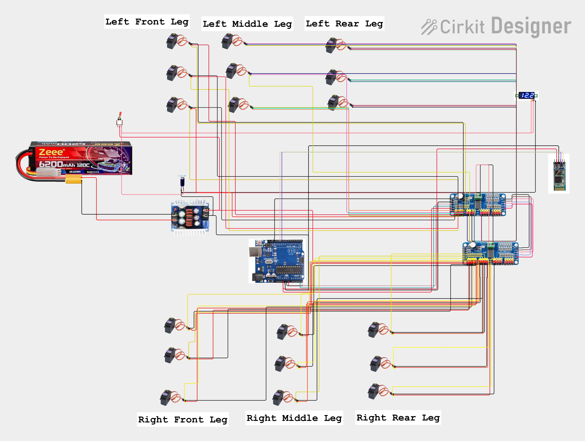

# 🕷️ Hexapod Robot – PCA9685

A six-legged robotic platform based on **Arduino UNO** and **two PCA9685 16-channel servo driver boards**. The robot uses **18 servo motors** and a **tripod gait mechanism** to achieve stable and coordinated walking.

The system integrates **HC-05 Bluetooth wireless control**, dual PCA9685 servo control, and battery voltage monitoring for multi-servo robotic movement.

## 📌 Project Overview

This project focuses on designing and controlling a **six-legged hexapod robot** using an Arduino UNO and two PCA9685 servo driver modules.

The robot has **18 servo motors**, with three servos controlling each leg. Two PCA9685 boards provide the required PWM channels to control all 18 servos.

The robot uses a **tripod gait mechanism**, where the six legs are divided into two groups. The two groups move alternately to provide stable and coordinated locomotion.

An **HC-05 Bluetooth module** is used for wireless control, allowing the robot to receive movement commands from a Bluetooth-enabled device.

## 🚀 Features

- Six-legged hexapod robotic structure
- 18-servo multi-joint control
- Tripod gait mechanism
- Stable and coordinated walking
- Forward movement
- Backward movement
- Left turning
- Right turning
- Up and down movement
- Stand / home position
- Wireless Bluetooth control
- Dual PCA9685 servo driver system
- Real-time battery voltage monitoring
- Arduino UNO based control
- Battery-powered operation

## 🧠 Technologies Used

- Arduino UNO
- Embedded C / Arduino Programming
- Arduino IDE
- PCA9685 PWM Servo Driver
- Servo Motor Control
- Tripod Gait Algorithm
- Robotics Motion Control
- Bluetooth Communication
- I2C Communication
- Multi-Actuator Coordination

## 🔧 Hardware Components

| Component | Quantity |
|---|---:|
| Arduino UNO | 1 |
| PCA9685 16-Channel Servo Driver | 2 |
| Servo Motors | 18 |
| HC-05 Bluetooth Module | 1 |
| Toggle Switch | 1 |
| 3-Digit Voltage Display | 1 |
| LiPo Battery | 1 |
| Male Jack | 1 |
| Buck Converter | 1 |
| 2200 µF Electrolytic Capacitor | 1 |

## ⚙️ Working Principle

The hexapod uses a **tripod gait mechanism** for stable walking.

Each of the six legs uses three servo motors:

- **Coxa** – controls the forward/backward swing of the leg
- **Femur** – controls the upper leg movement
- **Tibia** – controls the lower leg movement

The two PCA9685 boards provide PWM control for all 18 servo motors.

### 🦿 Tripod Gait

The six legs are divided into two tripod groups.

**Tripod A**

- Left Front (LF)
- Left Rear (LR)
- Right Middle (RM)

**Tripod B**

- Left Middle (LM)
- Right Front (RF)
- Right Rear (RR)

The two tripod groups move alternately.

```text
Tripod A
   ↓
Legs move
   ↓
Tripod B supports body
   ↓
Tripod B
   ↓
Legs move
   ↓
Tripod A supports body
   ↓
Repeat
```

This alternating movement allows the robot to maintain balance while walking.

## 🎮 Bluetooth Control

The robot uses an **HC-05 Bluetooth module** to receive movement commands.

The Arduino processes the received command and generates the corresponding servo movements.

| Command | Function |
|---|---|
| `s` | Stand / Home Position |
| `u` | Move Up |
| `d` | Move Down |
| `f` | Forward |
| `b` | Backward |
| `l` | Turn Left |
| `r` | Turn Right |

## 🔄 Movement System

### Forward

The robot performs a coordinated **tripod gait** in which Tripod A and Tripod B move alternately to produce forward locomotion.

### Backward

The robot uses the same tripod gait principle in the reverse direction to move backward.

### Left Turn

The robot performs an in-place left-turn movement by coordinating the servo positions of the two tripod groups.

### Right Turn

The robot performs an in-place right-turn movement using coordinated servo positions.

### Move Up

The servos move the robot body upward to the predefined raised position.

### Move Down

The servos move the robot body downward to the predefined lowered position.

### Stand / Home

All 18 servos move to their predefined home/standing positions.

## 🎛️ PCA9685 Servo Control

Two PCA9685 servo driver boards are used to control the 18 servo motors.

### PCA9685 Board 1

**I2C Address: `0x40`**

Controls:

- Servos 1–9

### PCA9685 Board 2

**I2C Address: `0x41`**

Controls:

- Servos 10–18

The Arduino communicates with both PCA9685 boards using the **I2C interface**.

```text
                  Arduino UNO
                      │
                I2C Communication
                 ┌────┴────┐
                 │         │
                 ▼         ▼
          PCA9685 #1   PCA9685 #2
            0x40          0x41
              │             │
          Servos 1–9    Servos 10–18
              │             │
              └──────┬──────┘
                     ▼
                Hexapod Robot
```

## 🔢 Servo Mapping

The hexapod uses **18 servo motors**, with three servos assigned to each leg.

| Servo Numbers | Leg | Joints |
|---|---|---|
| 1–3 | Left Front (LF) | Coxa, Femur, Tibia |
| 4–6 | Left Middle (LM) | Coxa, Femur, Tibia |
| 7–9 | Left Rear (LR) | Coxa, Femur, Tibia |
| 10–12 | Right Front (RF) | Coxa, Femur, Tibia |
| 13–15 | Right Middle (RM) | Coxa, Femur, Tibia |
| 16–18 | Right Rear (RR) | Coxa, Femur, Tibia |

### Individual Servo Assignment

| Servo | Leg | Joint | Function |
|---:|---|---|---|
| 1 | Left Front (LF) | Coxa | Leg swing |
| 2 | Left Front (LF) | Femur | Leg lift/lower |
| 3 | Left Front (LF) | Tibia | Lower-leg movement |
| 4 | Left Middle (LM) | Coxa | Leg swing |
| 5 | Left Middle (LM) | Femur | Leg lift/lower |
| 6 | Left Middle (LM) | Tibia | Lower-leg movement |
| 7 | Left Rear (LR) | Coxa | Leg swing |
| 8 | Left Rear (LR) | Femur | Leg lift/lower |
| 9 | Left Rear (LR) | Tibia | Lower-leg movement |
| 10 | Right Front (RF) | Coxa | Leg swing |
| 11 | Right Front (RF) | Femur | Leg lift/lower |
| 12 | Right Front (RF) | Tibia | Lower-leg movement |
| 13 | Right Middle (RM) | Coxa | Leg swing |
| 14 | Right Middle (RM) | Femur | Leg lift/lower |
| 15 | Right Middle (RM) | Tibia | Lower-leg movement |
| 16 | Right Rear (RR) | Coxa | Leg swing |
| 17 | Right Rear (RR) | Femur | Leg lift/lower |
| 18 | Right Rear (RR) | Tibia | Lower-leg movement |

### Example Servo Command

Servo 10 controls the **Coxa joint of the Right Front (RF) leg**.

```cpp
moveServo(10, COXA_RIGHT_FWD);
```

This command moves the Right Front leg's coxa joint to the predefined forward position, causing the leg to swing forward.

## 🔋 Power System

The robot is powered using a **LiPo battery**.

A **buck converter** is used as part of the power management system.

A **3-digit voltage display** is included to monitor the battery voltage during operation.

A **2200 µF electrolytic capacitor** is used in the power system to help reduce voltage fluctuations caused by the multiple servo motors.

## 📡 Bluetooth Communication

The HC-05 Bluetooth module is connected to the Arduino UNO for wireless command reception.

The Arduino receives commands and converts them into predefined movement functions.

```text
Bluetooth Device
       │
       ▼
    HC-05
       │
       ▼
  Arduino UNO
       │
       ▼
   PCA9685 Boards
       │
       ▼
  18 Servo Motors
       │
       ▼
 Hexapod Movement
```

## 🔌 Circuit Diagram



## 📂 Project Structure

```text
Hexapod_Robot_PCA9685/
│
├── README.md
├── hexapod_walking.ino
└── circuit_diagram.png
```

## ▶️ How to Run

1. Connect the two PCA9685 servo driver boards to the Arduino UNO.
2. Configure the PCA9685 boards with I2C addresses `0x40` and `0x41`.
3. Connect servos 1–9 to the first PCA9685 board.
4. Connect servos 10–18 to the second PCA9685 board.
5. Connect the HC-05 Bluetooth module to the Arduino.
6. Connect the battery and power management system.
7. Verify all servo and power connections.
8. Upload `hexapod_walking.ino` using the **Arduino IDE**.
9. Pair a Bluetooth-enabled device with the HC-05.
10. Send the required movement commands.
11. The Arduino processes the commands and controls the 18 servos through the PCA9685 boards.

## 💻 Arduino Code

The complete Arduino source code is provided in the `.ino` file included in this repository.

**Arduino File:** `hexapod_walking.ino`

## 🛠️ Platform

**Arduino UNO**

## 📌 Project Type

**Arduino Robotics | Hexapod Robot | Multi-Servo Control | Tripod Gait**

## 🚀 Applications

- Educational robotics
- Multi-legged robotic systems
- Servo control experiments
- Gait algorithm development
- Robotics prototyping
- Bluetooth-controlled robots
- Embedded robotics projects

## 🔮 Future Improvements

- Autonomous obstacle avoidance
- Ultrasonic sensor integration
- Camera integration
- ROS 2 integration
- IMU-based balance control
- Terrain-adaptive gait
- Autonomous navigation
- AI-based gait optimization
- Computer vision integration
- Mobile application control

## 👨‍💻 Author

**Subrat**

AI & Robotics Enthusiast

## ⭐ About This Project

This project demonstrates the practical implementation of a **multi-legged robotic system using Arduino UNO, dual PCA9685 servo drivers, 18 servo motors, and Bluetooth communication**.

It highlights important robotics concepts including **servo synchronization, I2C communication, tripod gait algorithms, multi-actuator coordination, wireless control, and embedded motion control**.

The project provides a foundation for developing more advanced **autonomous and intelligent hexapod robotic systems**.
